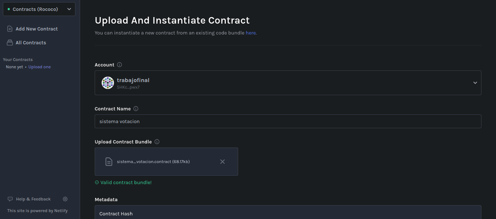
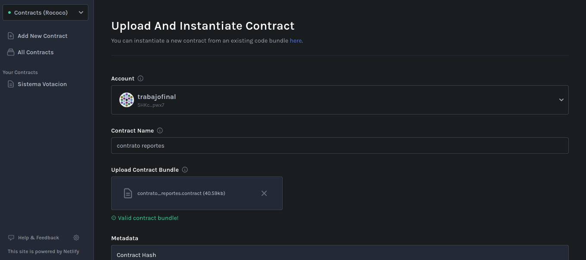
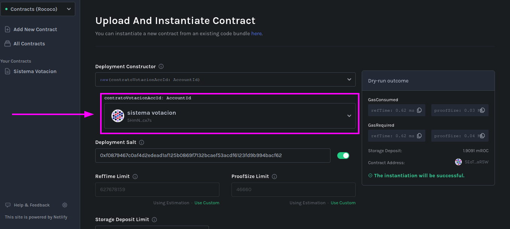
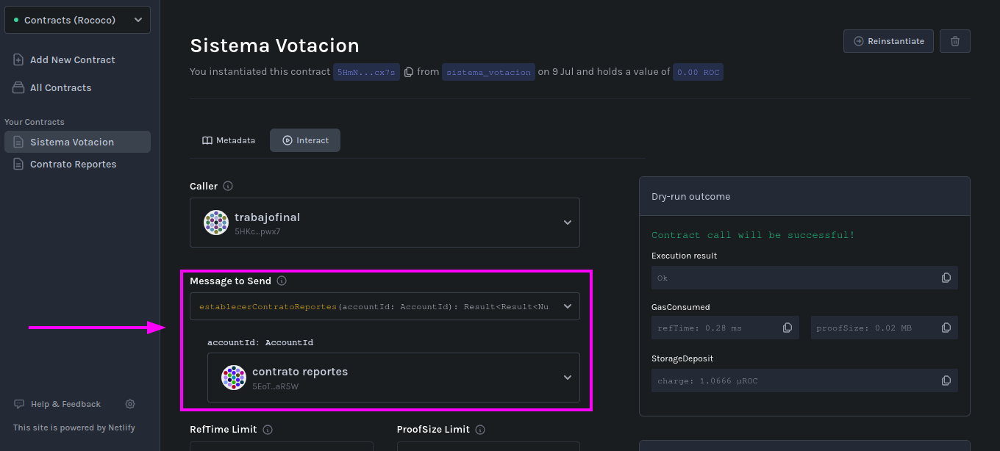

# Rust-TP-Final

## 1. Introducción
Este es el trabajo final de la materia Seminario de Lenguajes opción Rust, consta de un sistema de votación electrónica seguro y transparente utilizando tecnología blockchain. Este sistema permitirá la participación de diferentes roles de usuario y asegurará que los resultados de la votación se mantengan confidenciales hasta el cierre oficial de la elección.

## 2. Funcionamiento
El sistema está conformado por dos contratos inteligentes basados en [Ink!](https://use.ink/), uno se encarga de administrar la elección, junto con los candidatos y sus electores, y otro se encarga de reportar resultados e información sobre el primero.

## 2.1 Sistema de Votación
Este contrato se encarga de lo siguiente:
* Administrar usuarios.
* Gestionar roles.
* Controlar y verificar permisos.
* Llevar a cabo elecciones de manera transparente y segura.

Entre otras cosas.

Para lograr lo anterior, el contrato recibe los siguientes mensajes:
1. `registrarUsuario`: Registra un usuario en el sistema.
2. `registrarEnEleccion`: Registra a un usuario del sistema en una elección determinada.
3. `crearEleccion`: Permite al administrador del sistema crear una elección.
4. `delegarAdmin`: Permite ceder los privilegios de administrador.
5. `consultarMiembrosNoVerificados`: Consulta los electores o candidatos pendientes de aprobación.
6. `consultarCandidatosDisponibles`: Consulta los candidatos aprobados para una elección.
7. `cambiarEstadoAprobacion`: Permite al administrador aprobar o rechazar a un elector o candidato.
8. `consultarEstado`: Consulta el estado actual de una elección.
9. `votar`: Permite a un elector emitir su voto.
10. `consultarInfoVotantesAprobados`: Consulta la información de los electores aprobados para una elección.
11. `establecerContratoReportes`: Establece el contrato que podrá acceder a información del sistema.

**Nota**: En la anterior lista se obviaron mensajes que son usados exclusivamente por el otro contrato o internamente.

## 2.2 Contrato de Reportes
Este contrato se encarga de reportar información de una elección mediante los siguientes mensajes:
1. `reporteVotantes`: Informa los electores aprobados.
2. `reporteParticipacion`: Informa la cantidad de votos emitidos y porcentaje de participación.
3. `reporteResultado`: Informa los candidatos y sus votos obtenidos.
   
## 3. Instrucciones
Para iniciar el sistema correctamente se deben seguir los pasos descritos a continuación:

1. Compilar ambos contratos:
   
   ```bash
   $ cargo contract build
   ```
2. [Instanciar](https://ui.use.ink/instantiate) el sistema de votación:
   
3. Instanciar el contrato de reportes con el sistema de votación:
   
   
4. Establecer el contrato de reportes en el sistema de votación:
   

## 4. Integrantes
Los integrantes del trabajo son:
* [ferreroianjose](https://github.com/ferreroianjose)
* [nahueluna](https://github.com/nahueluna)
* [valentinoamato](https://github.com/valentinoamato)
* [Noxde](https://github.com/Noxde)
* [germangarcia99](https://github.com/germangarcia99)
* [Zajitario](https://github.com/Zajitario)